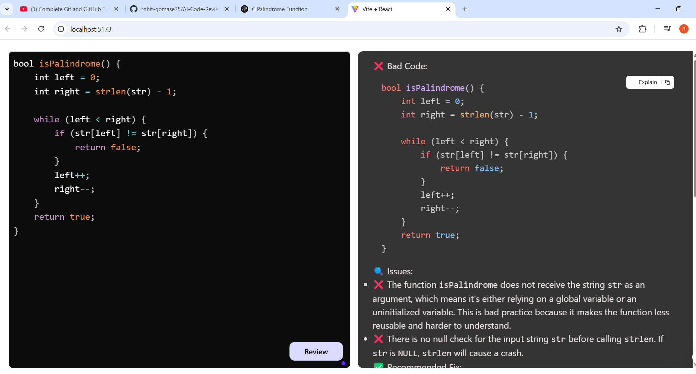
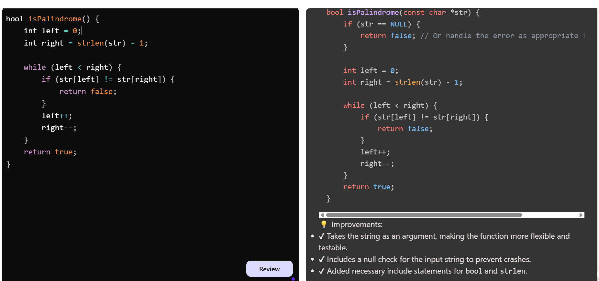

# AI Code Reviewer

## Overview
AI Code Reviewer is an intelligent tool that assists developers in reviewing and improving their code quality using AI-driven insights. It leverages Google Gemini API to provide automated feedback, suggestions, and improvements.

## Features
- **Automated Code Analysis**: Scans and reviews your code for potential improvements.
- **AI-Powered Suggestions**: Provides recommendations for better performance, readability, and maintainability.
- **Error Detection**: Identifies bugs, vulnerabilities, and best practices.
- **Integration with Development Environments**: Easily integrates with popular IDEs and repositories.

## Installation
1. Clone the repository:
   ```sh
   git clone <repository-url>
   ```
2. Navigate to the project directory:
   ```sh
   cd AI-Code-Reviewer
   ```
3. Install dependencies:
   ```sh
   npm install
   ```
4. Set up your Google Gemini API key in a `.env` file:
   ```sh
   GOOGLE_GEMINI_API_KEY=your_api_key_here
   ```

## Usage
To start the application, run:
```sh
npm start
```

## Screenshots

These are some examples while testing it : 






